# Navigationsleiste
Eine Navigationsleiste (Navigation Bar oder Nav Bar) ist eine UI-Komponente, die Benutzern eine Übersicht und Zugang zu den Hauptbereichen oder Funktionen einer Website oder Anwendung bietet.

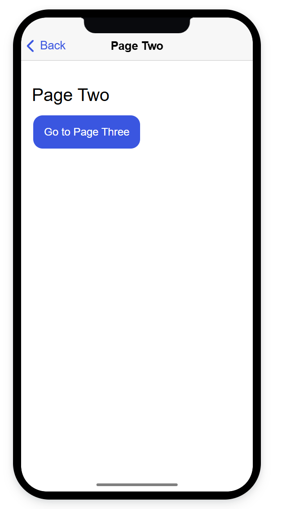

## Zweck:
1. Dateneingabe und -erfassung
2. Interaktion und Kommunikation
3. Validierung und Fehlerbehandlung
4. Datenstrukturierung und -verarbeitung

# Formular
Ein Formular (UI-Komponente) ist eine Benutzerschnittstelle, die Nutzern ermöglicht, Daten in einer strukturierten Weise einzugeben und an eine Anwendung oder ein System zu übermitteln.

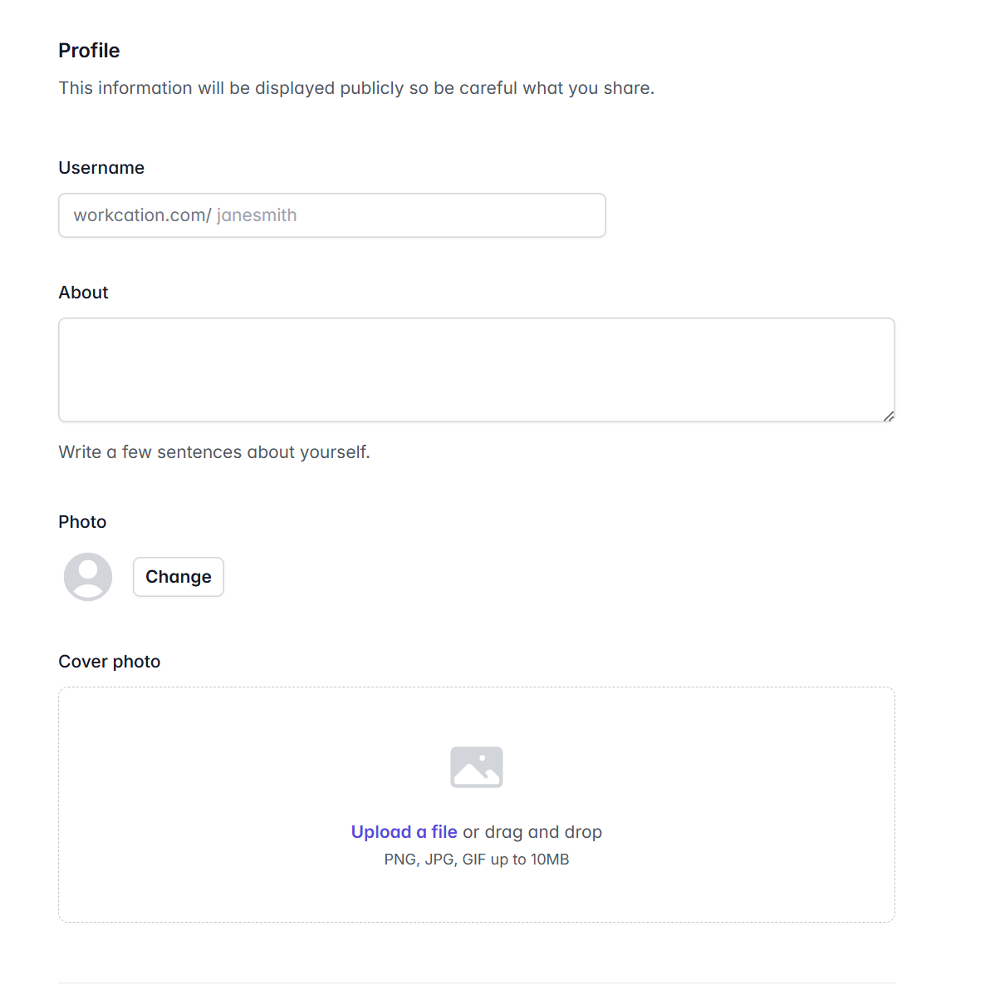

## Zweck:
1. Struktur und Orientierung
2. Schneller Zugriff auf wichtige Inhalte
3. Verbesserung der Benutzererfahrung
4. Konsistenz in der Benutzeroberfläche

# Tab
Tabs sind eine weitere häufig verwendete UI-Komponente, die es ermöglicht, Inhalte in einer Anwendung oder Website zu organisieren und zu strukturieren.

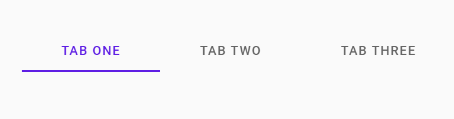

## Zweck:
1. Struktur und Orientierung
2. Schneller Zugriff auf wichtige Inhalte
3. Verbesserung der Benutzererfahrung
4. Konsistenz in der Benutzeroberfläche

# Modale Dialog
Modale Dialoge (oder einfach Modals) sind UI-Komponenten, die in vielen Anwendungen verwendet werden, um eine Nachricht oder Aktion fokussiert anzuzeigen und die Interaktion des Benutzers mit anderen Bereichen der Anwendung vorübergehend zu unterbrechen.

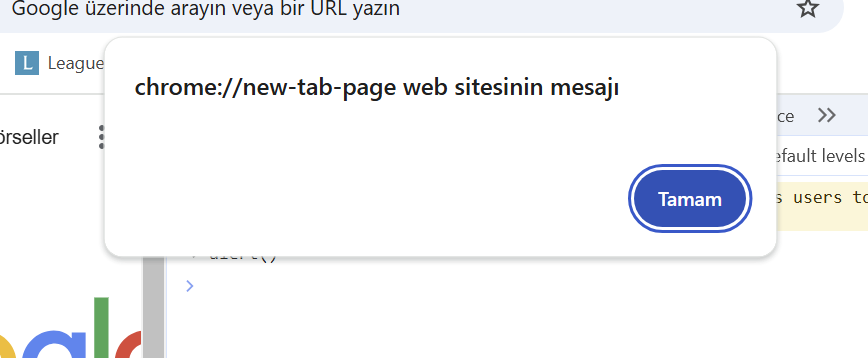

# Pop-up
Pop-ups sind UI-Komponenten, die plötzlich auf einer Webseite oder in einer Anwendung erscheinen und dem Benutzer eine Nachricht oder einen Inhalt anzeigen.

# Tooltip
Ein Tooltip ist eine kleine, kontextuelle UI-Komponente, die zusätzliche Informationen über ein Element auf der Benutzeroberfläche bereitstellt, wenn der Benutzer mit der Maus darüber fährt oder ein bestimmtes Element fokussiert.

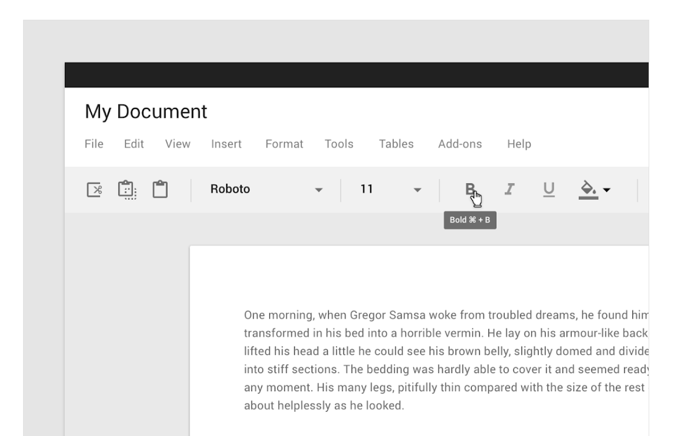

# Accordion
Eine Komponente, die es ermöglicht, Inhalte in einer hierarchischen Struktur anzuzeigen und aus- und einzuklappen.

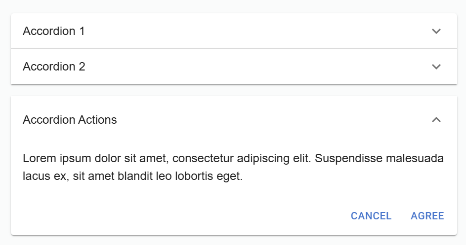

# Multiselect
Ein UI-Element, das es Benutzern ermöglicht, mehrere Optionen aus einer Liste auszuwählen.

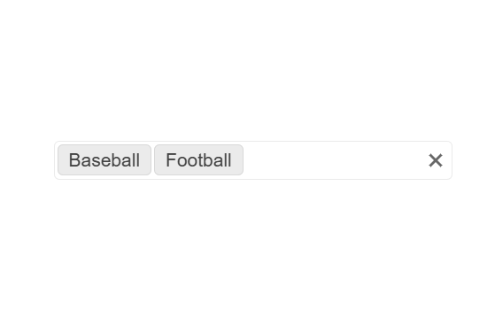

# Date Picker
Ein UI-Element, das es Benutzern ermöglicht, Datumsangaben auszuwählen, indem sie auf einen Kalender klicken.

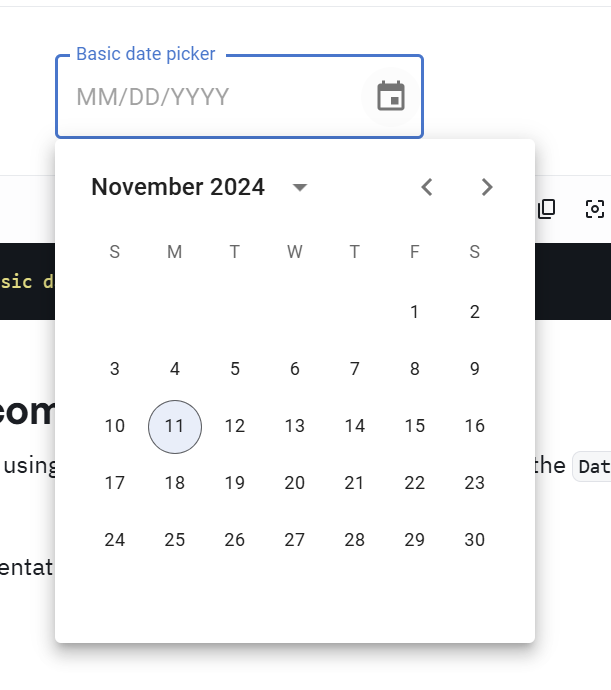

# Autocomplete
Eine Komponente, die Vorschläge basierend auf dem eingegebenen Text anzeigt und erleichtert die Eingabe von Text.

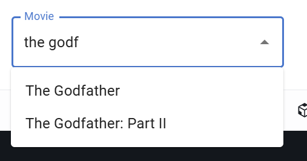

# Slider
Ein UI-Element, das es Benutzern ermöglicht, Werte aus einem bestimmten Bereich auszuwählen, indem sie einen Regler bewegen.

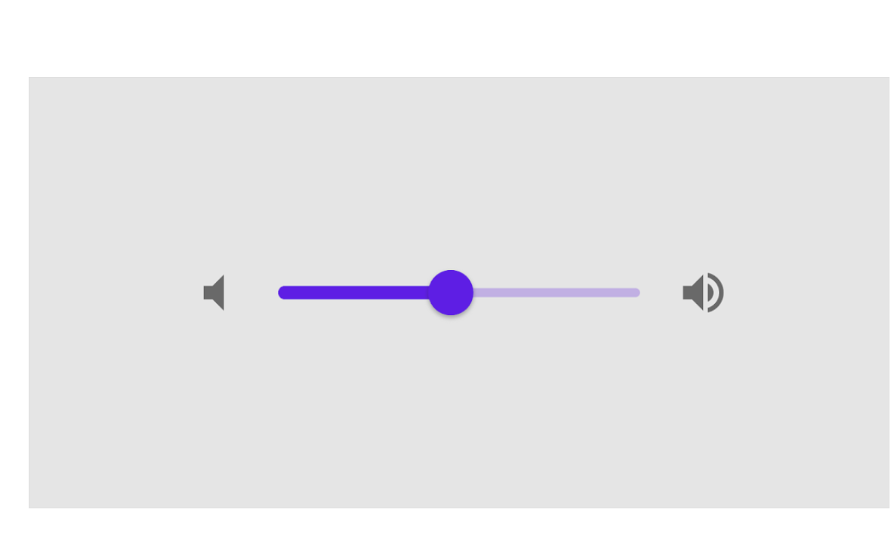

# Progress Bar
Eine Komponente, die den Fortschritt einer Aktion anzeigt.

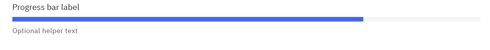

# Carousel/Slideshow
Eine Komponente, die es ermöglicht, Bilder oder andere Inhalte in einer Diashow anzuzeigen.

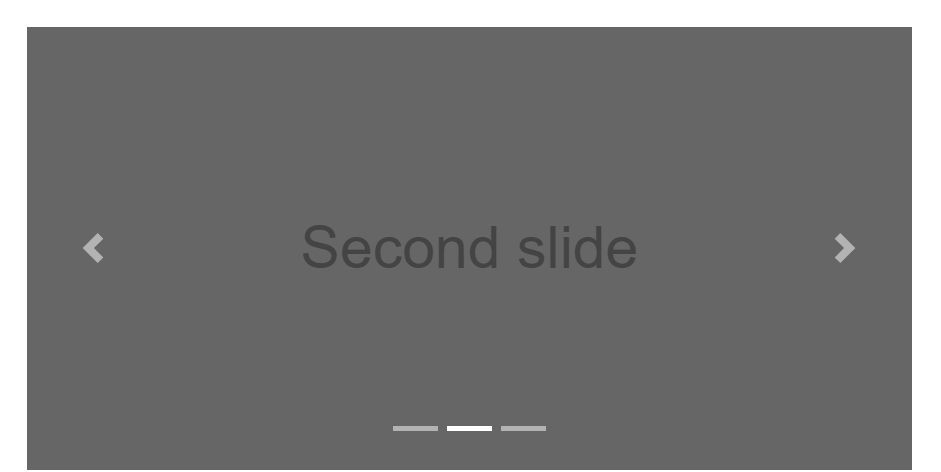

# Rating
Eine Komponente, die es Benutzern ermöglicht, eine Bewertung abzugeben, indem sie Sterne oder andere Symbole auswählen.

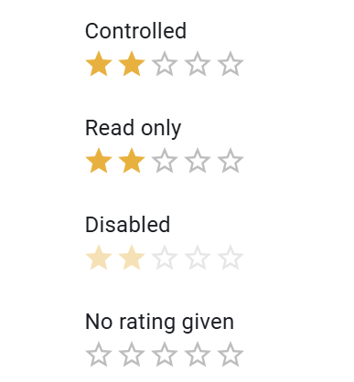

# Treeview
Eine Komponente, die es ermöglicht, hierarchische Strukturen anzuzeigen und zu navigieren.

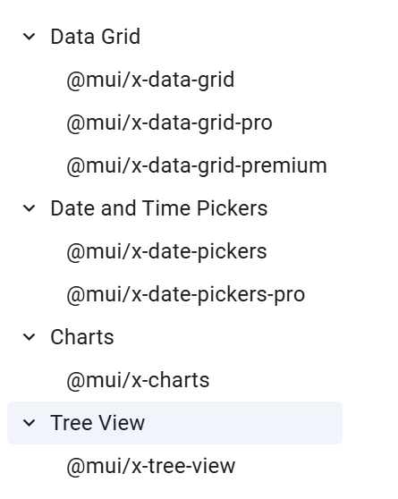